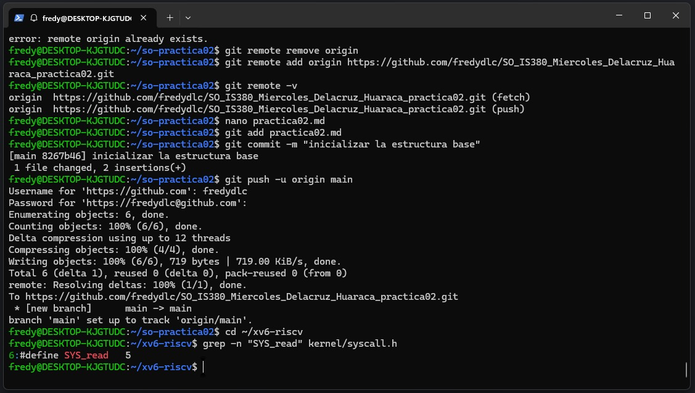
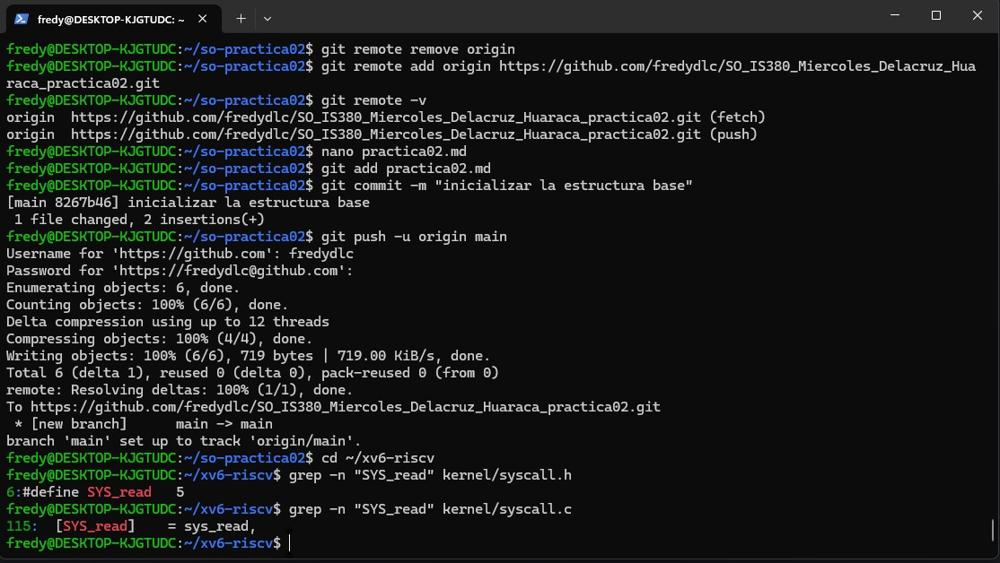
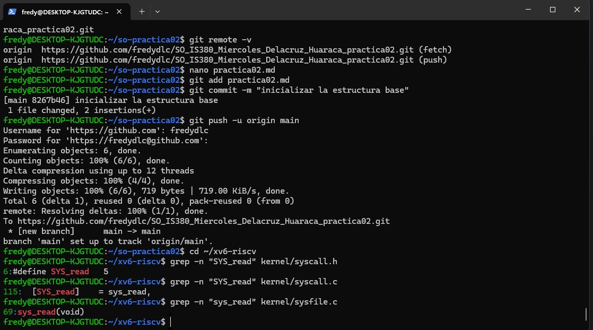
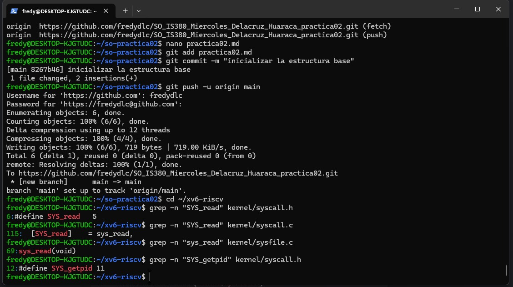
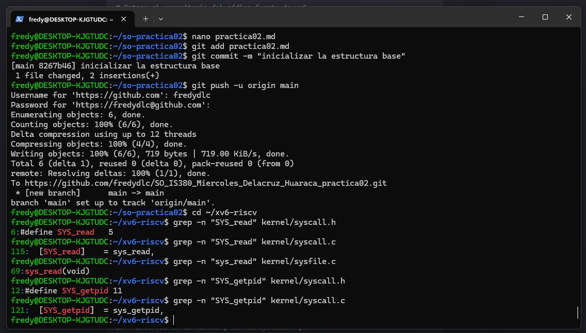
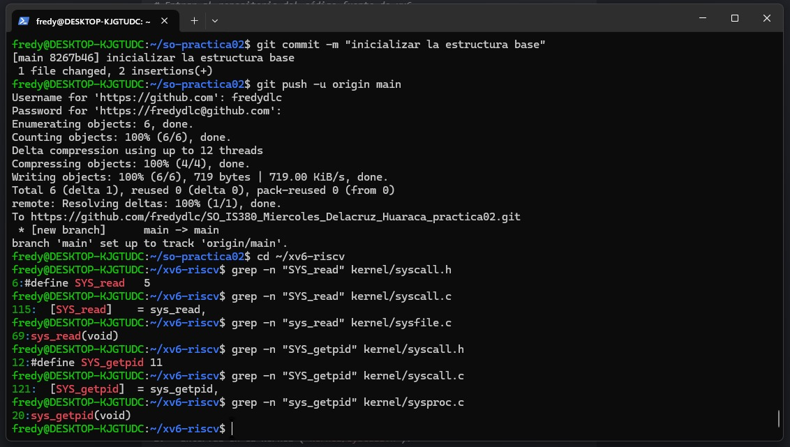
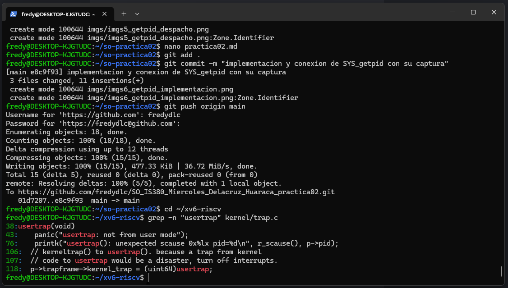

# Práctica Calificada 002 - Llamadas al Sistema en xv6

**Estudiante:** Fredy Delacruz Huaraca  
**Curso:** Sistemas Operativos (IS-380)  
**Semana:** Práctica 02  

---
## 1. Interfaz, tabla de despacho e implementación de dos llamadas al sistema
A continuación se detalla el rastreo completo de las llamadas `read` y `getpid`.

### A. RASTREO COMPLETO DE LA LLAMADA AL SISTEMA: `read`

#### 1. Interfaz en el Kernel (`kernel/syscall.h`)
Al realizar la búsqueda en los archivos de cabecera del núcleo, localizamos la directiva del preprocesador que asigna el identificador numérico único a la llamada mediante el macro `#define SYS_read 5`. Este número entero representa la interfaz que el espacio de usuario emplea para invocar el servicio.

#### 2. Entrada en la Tabla de Despacho (`kernel/syscall.c`)
La constante `SYS_read` se utiliza directamente como un índice posicional 
dentro del arreglo global de punteros de función `static uint64 (*syscalls)(void)`. 
La línea exacta mapea la relación `[SYS_read] sys_read`,
 asociando el identificador 5 con la función encargada de su despacho.

#### 3. Implementación de la Función (`kernel/sysfile.c`)
La lógica operativa e interna se encuentra codificada dentro de `kernel/sysfile.c` bajo la firma `uint64 sys_read(void)`. Esta rutina se encarga de validar los descriptores de archivos del proceso, interactuar con los buffers del sistema de almacenamiento y transferir los bloques de datos leídos hacia el espacio de memoria asignado al usuario.

*   **Párrafo de Conexión Integral:** 
    Cuando un programa de usuario invoca la función estándar `read()`, la arquitectura de hardware y las bibliotecas cargan el identificador numérico `SYS_read` (5) como parámetro de la interfaz. Al cruzar la frontera del núcleo mediante el mecanismo de excepciones, la función de despacho utiliza este índice 5 para consultar de forma atómica el arreglo vectorizado `syscalls`. Este mapeo redirige de inmediato el flujo del procesador hacia la dirección exacta de memoria donde reside la función de aislamiento `sys_read()`, resolviendo la solicitud dentro del espacio protegido del kernel de manera monolítica.

---

### B. RASTREO COMPLETO DE LA LLAMADA AL SISTEMA: `getpid`

#### 1. Interfaz en el Kernel (`kernel/syscall.h`)
El rastreo localiza la definición simbólica del identificador mediante el macro `#define SYS_getpid 11`. El entero 11 actúa como el token contractual inalterable entre el modo usuario y el modo supervisor para realizar la solicitud de identidad del proceso.

#### 2. Entrada en la Tabla de Despacho (`kernel/syscall.c`)
Dentro de la tabla de vectores de despacho `syscalls`, la constante se encuentra indexada explícitamente en la línea `[SYS_getpid] sys_getpid`. El kernel utiliza esta posición fija (11) para resolver la llamada sin necesidad de utilizar estructuras condicionales lentas.

#### 3. Implementación de la Función (`kernel/sysproc.c`)
La implementación real se halla en el archivo de gestión de procesos `kernel/sysproc.c` bajo la firma `uint64 sys_getpid(void)`. Su alcance operativo consiste en interrogar de manera segura el contexto del proceso que está en ejecución en ese instante mediante `myproc()` y retornar el valor primitivo almacenado en el campo interno `p->pid`.

*   **Párrafo de Conexión Integral:** 
    El número contractual `SYS_getpid` (11) viaja desde el entorno aislado de la aplicación hacia el subsistema de despacho del núcleo. Al ser recibido, la tabla indexada `syscalls` toma el índice 11 como un puntero directo de salto. Este direccionamiento transfiere de inmediato el control de ejecución a la rutina especializada `sys_getpid()` en `kernel/sysproc.c`, la cual tiene los privilegios de hardware requeridos para inspeccionar las estructuras protegidas de la tabla de procesos del sistema operativo y devolver el identificador PID al espacio del usuario de manera segura.

---

## 2. Investigación: El mecanismo de trampa (trap)

### Explicación detallada del camino de ejecución (Caso de estudio: `getpid`)
El viaje de una llamada al sistema a través de las capas de hardware y software se ejecuta bajo un estricto protocolo de aislamiento:

1. **Fase de Preparación (Modo Usuario):** Cuando el programa invoca la función del entorno de usuario `getpid()`, la biblioteca de C carga el número identificador único `SYS_getpid` (11) en el registro físico de la CPU denominado `a7`.
2. **Fase de Transición de Privilegios (`ecall`):** El programa ejecuta la instrucción de hardware `ecall`. En ese nanosegundo, el procesador RISC-V detiene la ejecución del código de usuario, eleva el nivel de privilegios al modo Supervisor (Modo Kernel), almacena la dirección de retorno en el registro especial `sepc`, y transfiere el flujo a la rutina común de gestión de trampas e interrupciones del kernel llamada `usertrap()` en `kernel/trap.c`.

